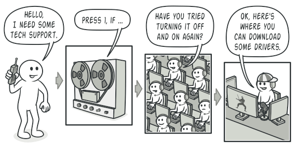
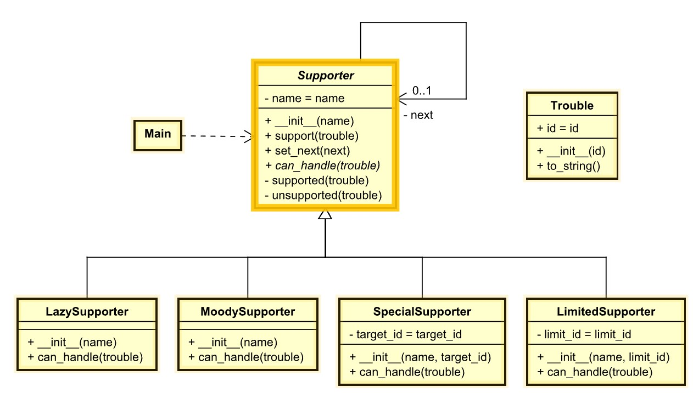

# Chain of responsibility
Also known as: **CoR**, **Chain of Command**

## Intent

**Chain of Responsibility** is a behavioral design pattern that lets you pass requests along a chain of handlers. Upon receiving a request, each handler decides either to process the request or to pass it to the next handler in the chain.

## Problem

Imagine that you’re working on an online ordering system. You want to restrict access to the system so only authenticated users can create orders. Also, users who have administrative permissions must have full access to all orders.

After a bit of planning, you realized that these checks must be performed sequentially. The application can attempt to authenticate a user to the system whenever it receives a request that contains the user’s credentials. However, if those credentials aren’t correct and authentication fails, there’s no reason to proceed with any other checks.

*The request must pass a series of checks before the ordering system itself can handle it.*

During the next few months, you implemented several more of those sequential checks.

- One of your colleagues suggested that it’s unsafe to pass raw data straight to the ordering system. So you added an extra validation step to sanitize the data in a request.

- Later, somebody noticed that the system is vulnerable to brute force password cracking. To negate this, you promptly added a check that filters repeated failed requests coming from the same IP address.

- Someone else suggested that you could speed up the system by returning cached results on repeated requests containing the same data. Hence, you added another check which lets the request pass through to the system only if there’s no suitable cached response.

*The bigger the code grew, the messier it became.*

The code of the checks, which had already looked like a mess, became more and more bloated as you added each new feature. Changing one check sometimes affected the others. Worst of all, when you tried to reuse the checks to protect other components of the system, you had to duplicate some of the code since those components required some of the checks, but not all of them.

The system became very hard to comprehend and expensive to maintain. You struggled with the code for a while, until one day you decided to refactor the whole thing.

## Solution
Like many other behavioral design patterns, the **Chain of Responsibility** relies on transforming particular behaviors into stand-alone objects called **handlers**. In our case, each check should be extracted to its own class with a single method that performs the check. The request, along with its data, is passed to this method as an argument.

The pattern suggests that you link these handlers into a chain. Each linked handler has a field for storing a reference to the next handler in the chain. In addition to processing a request, handlers pass the request further along the chain. The request travels along the chain until all handlers have had a chance to process it.

Here’s the best part: a handler can decide not to pass the request further down the chain and effectively stop any further processing.

In our example with ordering systems, a handler performs the processing and then decides whether to pass the request further down the chain. Assuming the request contains the right data, all the handlers can execute their primary behavior, whether it’s authentication checks or caching.

*Handlers are lined up one by one, forming a chain.*

However, there’s a slightly different approach (and it’s a bit more canonical) in which, upon receiving a request, a handler decides whether it can process it. If it can, it doesn’t pass the request any further. So it’s either only one handler that processes the request or none at all. This approach is very common when dealing with events in stacks of elements within a graphical user interface.

For instance, when a user clicks a button, the event propagates through the chain of GUI elements that starts with the button, goes along its containers (like forms or panels), and ends up with the main application window. The event is processed by the first element in the chain that’s capable of handling it. This example is also noteworthy because it shows that a chain can always be extracted from an object tree.

*A chain can be formed from a branch of an object tree.*

## Real-World Analogy

*A call to tech support can go through multiple operators.*

You’ve just bought and installed a new piece of hardware on your computer. Since you’re a geek, the computer has several operating systems installed. You try to boot all of them to see whether the hardware is supported. Windows detects and enables the hardware automatically. However, your beloved Linux refuses to work with the new hardware. With a small flicker of hope, you decide to call the tech-support phone number written on the box.

The first thing you hear is the robotic voice of the autoresponder. It suggests nine popular solutions to various problems, none of which are relevant to your case. After a while, the robot connects you to a live operator.

Alas, the operator isn’t able to suggest anything specific either. He keeps quoting lengthy excerpts from the manual, refusing to listen to your comments. After hearing the phrase “have you tried turning the computer off and on again?” for the 10th time, you demand to be connected to a proper engineer.

Eventually, the operator passes your call to one of the engineers, who had probably longed for a live human chat for hours as he sat in his lonely server room in the dark basement of some office building. The engineer tells you where to download proper drivers for your new hardware and how to install them on Linux. Finally, the solution! You end the call, bursting with joy.

## Example
A trouble is turned around among supporters, and the trouble will be handled by the supporter who can handle it.
There are four types of supporters below:
* LazySupporter doesn't handle any trouble
* MoodySupporter handles odd ID troubles
* SpecialSupporter handles a trouble of the target ID.
* LimitedSupporter handles troubles below the limit ID.

- [UML of example chain of responsibility](https://htmlpreview.github.io/?https://github.com/takaakit/uml-diagram-for-python-design-pattern-examples/blob/master/behavioral_patterns/chain_of_responsibility/DiagramMap.html)

- Structure:
    1. The Handler (`Supporter`) declares the interface, common for all concrete handlers. It usually contains just a single method for handling requests, but sometimes it may also have another method for setting the next handler on the chain.
    2. Concrete Handlers (`LazySupporter`, `MoodySupportter`, `SpecialSupporter`, `LimitedSupporter`) contain the actual code for processing requests. Upon receiving a request, each handler must decide whether to process it and, additionally, whether to pass it along the chain.

        Handlers are usually self-contained and immutable, accepting all necessary data just once via the constructor.
    3. The Client (`Main`) may compose chains just once or compose them dynamically, depending on the application’s logic. Note that a request can be sent to any handler in the chain—it doesn’t have to be the first one.

##  Applicability
- Use the Chain of Responsibility pattern when your program is expected to process different kinds of requests in various ways, but the exact types of requests and their sequences are unknown beforehand.
- Use the pattern when it’s essential to execute several handlers in a particular order.
- Use the CoR pattern when the set of handlers and their order are supposed to change at runtime.