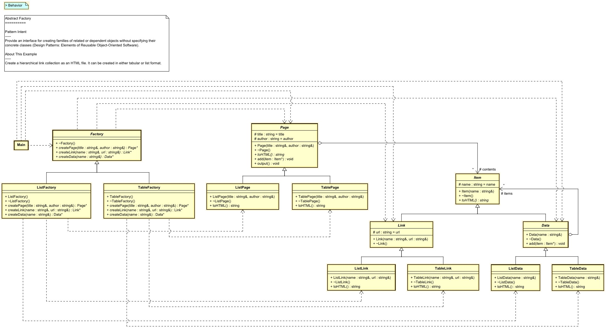

# Factory Abstract
Factory abstract design patterns are a way of creating families of related or dependent objects without specifying their concrete classes. They provide an interface for creating objects that follow a general pattern, and they allow the client to be independent of how the objects are created and composed. They also enable interchangeable concrete implementations without changing the code that uses them, even at runtime.

## About this example
Creata a hierachical link collections as an HTML file. it can be create in either tabular or list format.

[UML of example factory abstract](https://htmlpreview.github.io/?https://github.com/takaakit/uml-diagram-for-cpp-design-pattern-examples/blob/master/creational_patterns/abstract_factory/DiagramMap.html)



## Build the example
```
cd creational_patterns/abstract_factory
make
```