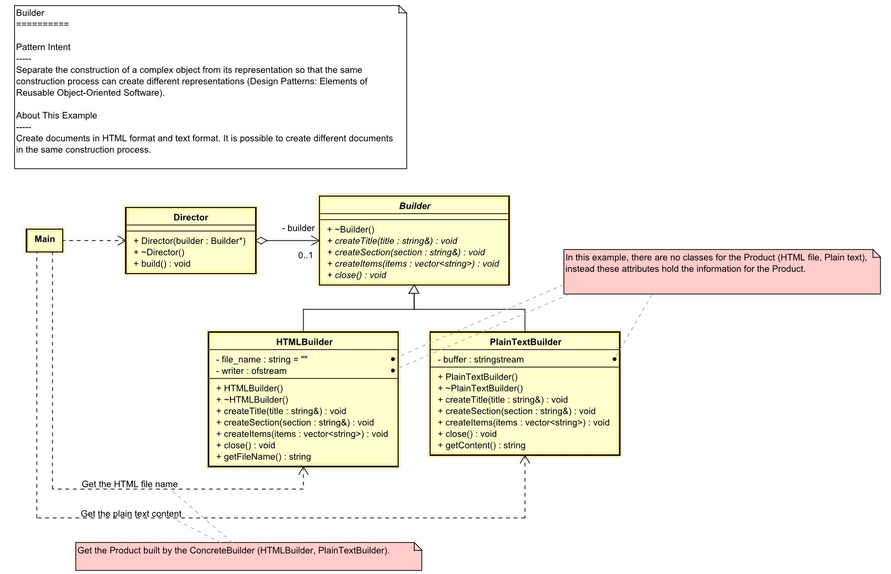

# Builder
The core concept of the builder design pattern is to separate the construction of a complex object from its representation. By doing so, the same construction process can create different representations of the same object. The builder design pattern is used to construct a complex object step by step and the final step will return the object. The builder design pattern also encapsulates the code for construction and representation, allows you to vary a product’s internal representation, and hides the details of the product’s implementation from the client.

## we should use the builder design pattern when we want to:

- **Get rid of the multiple constructors of a class**, where one differs from the others just by the number of parameters.
- **Build different immutable objects using the same object building process**.
- **Separate the construction of a complex object from its representation**. By doing so, the same construction process can create different representations of the same object.
- **Encapsulate the code for construction and representation**, allowing you to vary a product's internal representation and hide the details of the product's implementation from the client.

## About this Example
Create document in HTML format and text format. It is possible to create different document in the same construction process.

[UML of example builder](https://htmlpreview.github.io/?https://github.com/takaakit/uml-diagram-for-cpp-design-pattern-examples/blob/master/creational_patterns/builder/DiagramMap.html)

