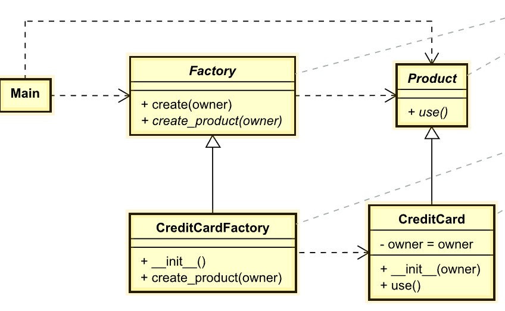

# Factory Method
Also known as: **Virtual Constructor**

## Intent
`Factory Method` is a creational design pattern that provides an interface for creating objects in a superclass, but allows subclasses to alter the type of objects that will be created.

## Problem
Imagine that you’re creating a logistics management application. The first version of your app can only handle transportation by trucks, so the bulk of your code lives inside the `Truck` class.

After a while, your app becomes pretty popular. Each day you receive dozens of requests from sea transportation companies to incorporate sea logistics into the app.

*Adding a new class to the program isn’t that simple if the rest of the code is already coupled to existing classes.*

Great news, right? But how about the code? At present, most of your code is coupled to the `Truck` class. Adding `Ships` into the app would require making changes to the entire codebase. Moreover, if later you decide to add another type of transportation to the app, you will probably need to make all of these changes again.

As a result, you will end up with pretty nasty code, riddled with conditionals that switch the app’s behavior depending on the class of transportation objects.

## Solution
The Factory Method pattern suggests that you replace direct object construction calls (using the `new` operator) with calls to a special factory method. Don’t worry: the objects are still created via the `new` operator, but it’s being called from within the factory method. Objects returned by a factory method are often referred to as *products*.

*Subclasses can alter the class of objects being returned by the factory method.*

At first glance, this change may look pointless: we just moved the constructor call from one part of the program to another. However, consider this: now you can override the factory method in a subclass and change the class of products being created by the method.

There’s a slight limitation though: subclasses may return different types of products only if these products have a common base class or interface. Also, the factory method in the base class should have its return type declared as this interface.

*All products must follow the same interface.*

For example, both `Truck` and `Ship` classes should implement the `Transport` interface, which declares a method called deliver. Each class implements this method differently: trucks deliver cargo by land, ships deliver cargo by sea. The factory method in the `RoadLogistics` class returns truck objects, whereas the factory method in the `SeaLogistics` class returns ships.

*As long as all product classes implement a common interface, you can pass their objects to the client code without breaking it.*

The code that uses the factory method (often called the client code) doesn’t see a difference between the actual products returned by various subclasses. The client treats all the products as abstract `Transport`. The client knows that all transport objects are supposed to have the `deliver` method, but exactly how it works isn’t important to the client.

## Example
The subject is a factory to make credit cards. The factory defines how to create a credit card, but the actual card is create by the `CreditCardFactory`. The `createProduct()` is called a Factory method, and it is responsible for manufacturing an object.

- [UML of example factory method](https://htmlpreview.github.io/?https://github.com/takaakit/uml-diagram-for-python-design-pattern-examples/blob/master/creational_patterns/factory_method/DiagramMap.html)

- Structure
    1. The `Product` declares the interface, which is common to all objects that can be produced by the creator and its subclasses.
    2. `CreditCard` are different implementations of the product interface.
    3. The `Factory` class declares the factory method that returns new product objects. It’s important that the return type of this method matches the product interface.
    You can declare the factory method as `abstract` to force all subclasses to implement their own versions of the method. As an alternative, the base factory method can return some default product type. \
    **Note**, despite its name, product creation is not the primary responsibility of the creator. Usually, the creator class already has some core business logic related to products. The factory method helps to decouple this logic from the concrete product classes.
    4. `CreditCardFactoty` override the base factory method so it returns a different type of product.\
    **Note** that the factory method doesn’t have to create new instances all the time. It can also return existing objects from a cache, an object pool, or another source.