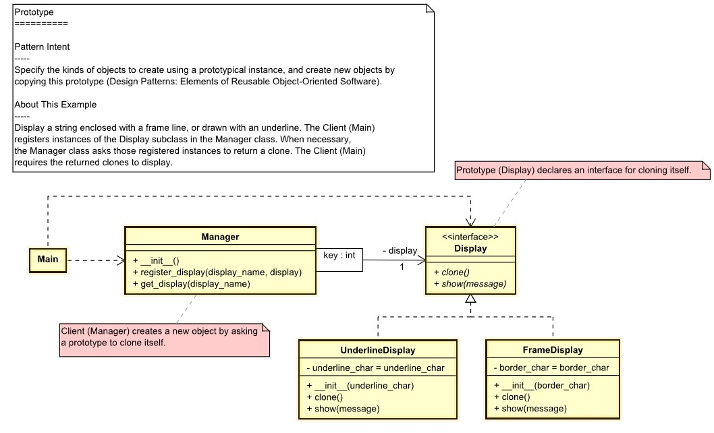

# Prototype
The prototype design pattern is a way of creating new objects by copying an existing object, rather than creating a new instance from scratch

## we should use the builder design pattern when we want to:
- Object creation is expensive or complex, and we want to avoid repeating the same process for each new object.
- The type of objects to create is determined at run-time, and we want to avoid using a large switch or if-else statement to instantiate different classes.
- We want to have a registry of prototypes that can be cloned and customized as needed.

## About this Example
Display a string enclosed with a frame line, or drawn with an underline. The Client (Main)
registers instances of the Display subclass in the Manager class. When necessary,
the Manager class asks those registered instances to return a clone. The Client (Main)
requires the returned clones to display.

[UML of example prototype](https://htmlpreview.github.io/?https://github.com/takaakit/uml-diagram-for-python-design-pattern-examples/blob/master/creational_patterns/prototype/DiagramMap.html)



## Build the example
```
cd creational_patterns/prototype
make
```