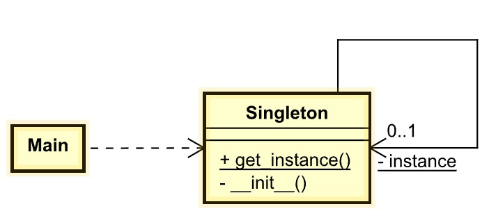

# Singleton

## Intent
**Singleton** is a creational design pattern that lets you ensure that a class has only one instance, while providing a global access point to this instance.

## Problem
The Singleton pattern solves two problems at the same time, violating the *Single Responsibility Principle*:

1. **Ensure that a class has just a single instance**. Why would anyone want to control how many instances a class has? The most common reason for this is to control access to some shared resource—for example, a database or a file. 
    
    Here’s how it works: imagine that you created an object, but after a while decided to create a new one. Instead of receiving a fresh object, you’ll get the one you already created.
    
    Note that this behavior is impossible to implement with a regular constructor since a constructor call must always return a new object by design.

2. **Provide a global access point to that instance**. Remember those global variables that you (all right, me) used to store some essential objects? While they’re very handy, they’re also very unsafe since any code can potentially overwrite the contents of those variables and crash the app.

    Just like a global variable, the Singleton pattern lets you access some object from anywhere in the program. However, it also protects that instance from being overwritten by other code.

    There’s another side to this problem: you don’t want the code that solves problem #1 to be scattered all over your program. It’s much better to have it within one class, especially if the rest of your code already depends on it.

Nowadays, the Singleton pattern has become so popular that people may call something a singleton even if it solves just one of the listed problems.

## Solution 
All implementations of the Singleton have these two steps in common:

- Make the default constructor private, to prevent other objects from using the `new` operator with the Singleton class.
- Create a `static` creation method that acts as a constructor. Under the hood, this method calls the private constructor to create an object and saves it in a static field. All following calls to this method return the cached object.

If your code has access to the Singleton class, then it’s able to call the Singleton’s static method. So whenever that method is called, the same object is always returned.

## Real-World Analogy
The government is an excellent example of the Singleton pattern. A country can have only one official government. Regardless of the personal identities of the individuals who form governments, the title, “The Government of X”, is a global point of access that identifies the group of people in charge.

## Example
Check whether the same instance is obtained.
- [UML of example simgleton](https://htmlpreview.github.io/?https://github.com/takaakit/uml-diagram-for-python-design-pattern-examples/blob/master/creational_patterns/singleton/DiagramMap.html)

- Structute
    1. The `Singleton` class declares the static method getInstance that returns the same instance of its own class.

        The Singleton’s constructor should be hidden from the client (`Main`) code. Calling the getInstance method should be the only way of getting the Singleton object.