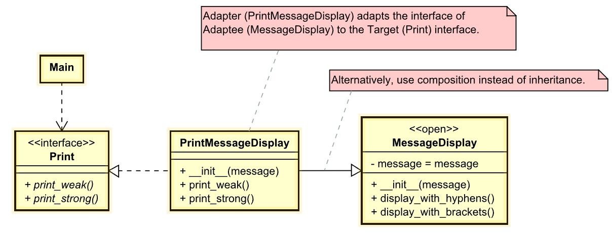

# Adapter
Also known as: *Wrapper*

## Intent
**Adapter** is a structural design pattern that allows objects with incompatible interfaces to collaborate.

## Problem
Imagine that you’re creating a stock market monitoring app. The app downloads the stock data from multiple sources in XML format and then displays nice-looking charts and diagrams for the user.

At some point, you decide to improve the app by integrating a smart 3rd-party analytics library. But there’s a catch: the analytics library only works with data in JSON format.

*You can’t use the analytics library “as is” because it expects the data in a format that’s incompatible with your app.*

You could change the library to work with XML. However, this might break some existing code that relies on the library. And worse, you might not have access to the library’s source code in the first place, making this approach impossible.

## Solution
You can create an *adapter*. This is a special object that converts the interface of one object so that another object can understand it.

An adapter wraps one of the objects to hide the complexity of conversion happening behind the scenes. The wrapped object isn’t even aware of the adapter. For example, you can wrap an object that operates in meters and kilometers with an adapter that converts all of the data to imperial units such as feet and miles.

Adapters can not only convert data into various formats but can also help objects with different interfaces collaborate. Here’s how it works:

1. The adapter gets an interface, compatible with one of the existing objects.
2. Using this interface, the existing object can safely call the adapter’s methods.
3. Upon receiving a call, the adapter passes the request to the second object, but in a format and order that the second object expects.

Sometimes it’s even possible to create a two-way adapter that can convert the calls in both directions.

Let’s get back to our stock market app. To solve the dilemma of incompatible formats, you can create XML-to-JSON adapters for every class of the analytics library that your code works with directly. Then you adjust your code to communicate with the library only via these adapters. When an adapter receives a call, it translates the incoming XML data into a JSON structure and passes the call to the appropriate methods of a wrapped analytics object.

## Real-World Analogy

When you travel from the US to Europe for the first time, you may get a surprise when trying to charge your laptop. The power plug and sockets standards are different in different countries. That’s why your US plug won’t fit a German socket. The problem can be solved by using a power plug adapter that has the American-style socket and the European-style plug.

## Example
Display the given string with difference style.

- [UML of example adapter](https://htmlpreview.github.io/?https://github.com/takaakit/uml-diagram-for-python-design-pattern-examples/blob/master/structural_patterns/adapter/DiagramMap.html)

- Structure
    - The `Main` is a class that contains the existing business logic of the program.
    - The `Print` Interface describes a protocol that other classes must follow to be able to collaborate with the main code.
    - The `MessageDisplay` is some useful class (usually 3rd-party or legacy). The main can’t use this class directly because it has an incompatible interface.
    - The `PrintMessageDisplay` is a class that’s able to work with both the `Print` and the `MessageDisplay`: it implements the client interface, while wrapping the `MessageDisplay` object. The adapter receives calls from the `Print` via the adapter interface and translates them into calls to the wrapped `MessageDisplay` object in a format it can understand.
    - The `Main` code doesn’t get coupled to the concrete adapter class as long as it works with the adapter via the `Print`. Thanks to this, you can introduce new types of adapters into the program without breaking the existing main code. This can be useful when the interface of the service class gets changed or replaced: you can just create a new adapter class without changing the main code

## Applicability
- Use the Adapter class when you want to use some existing class, but its interface isn’t compatible with the rest of your code.
- Use the pattern when you want to reuse several existing subclasses that lack some common functionality that can’t be added to the superclass