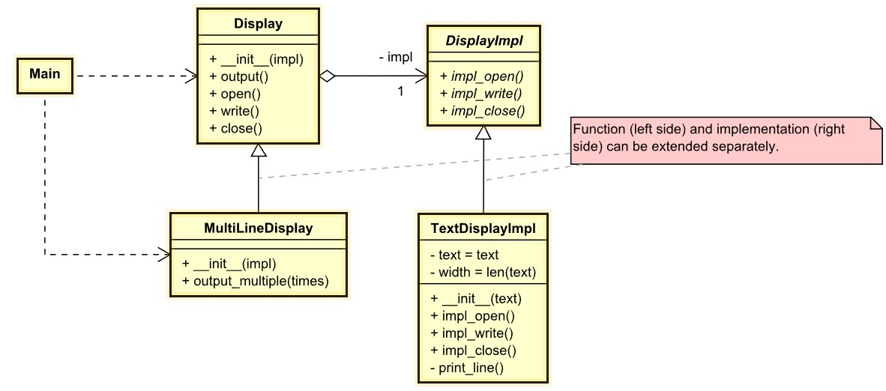

# Bridge
## Intent
Bridge is a structural design pattern that lets you split a large class or a set of closely related classes into two separate hierarchies—abstraction and implementation—which can be developed independently of each other.

## Problem
*Abstraction*? *Implementation*? Sound scary? Stay calm and let’s consider a simple example.

Say you have a geometric `Shape` class with a pair of subclasses: `Circle` and `Square`. You want to extend this class hierarchy to incorporate colors, so you plan to create `Red` and `Blue` shape subclasses. However, since you already have two subclasses, you’ll need to create four class combinations such as `BlueCircle` and `RedSquare`.

*Number of class combinations grows in geometric progression.*

Adding new shape types and colors to the hierarchy will grow it exponentially. For example, to add a triangle shape you’d need to introduce two subclasses, one for each color. And after that, adding a new color would require creating three subclasses, one for each shape type. The further we go, the worse it becomes.

## Solution
This problem occurs because we’re trying to extend the shape classes in two independent dimensions: by form and by color. That’s a very common issue with class inheritance.

The Bridge pattern attempts to solve this problem by switching from **inheritance** to the object **composition**. What this means is that you extract one of the dimensions into a separate class hierarchy, so that the original classes will reference an object of the new hierarchy, instead of having all of its state and behaviors within one class.

### Abstraction and Implementation
The GoF book  introduces the terms Abstraction and Implementation as part of the Bridge definition. In my opinion, the terms sound too academic and make the pattern seem more complicated than it really is. Having read the simple example with shapes and colors, let’s decipher the meaning behind the GoF book’s scary words.

Abstraction (also called interface) is a high-level control layer for some entity. This layer isn’t supposed to do any real work on its own. It should delegate the work to the implementation layer (also called platform).

**Note** that we’re not talking about interfaces or abstract classes from your programming language. These aren’t the same things.

When talking about real applications, the abstraction can be represented by a graphical user interface (GUI), and the implementation could be the underlying operating system code (API) which the GUI layer calls in response to user interactions.

Generally speaking, you can extend such an app in two independent directions:

- Have several different GUIs (for instance, tailored for regular customers or admins).
- Support several different APIs (for example, to be able to launch the app under Windows, Linux, and macOS).

In a worst-case scenario, this app might look like a giant spaghetti bowl, where hundreds of conditionals connect different types of GUI with various APIs all over the code.

*Making even a simple change to a monolithic codebase is pretty hard because you must understand the entire thing very well. Making changes to smaller, well-defined modules is much easier.*

You can bring order to this chaos by extracting the code related to specific interface-platform combinations into separate classes. However, soon you’ll discover that there are lots of these classes. The class hierarchy will grow exponentially because adding a new GUI or supporting a different API would require creating more and more classes.

Let’s try to solve this issue with the Bridge pattern. It suggests that we divide the classes into two hierarchies:

- Abstraction: the GUI layer of the app.
- Implementation: the operating systems’ APIs.

*One of the ways to structure a cross-platform application.*

The abstraction object controls the appearance of the app, delegating the actual work to the linked implementation object. Different implementations are interchangeable as long as they follow a common interface, enabling the same GUI to work under Windows and Linux.

As a result, you can change the GUI classes without touching the API-related classes. Moreover, adding support for another operating system only requires creating a subclass in the implementation hierarchy.

## Example
Display only one line or display the specified number of lines.
- [UML of example Bridge](https://htmlpreview.github.io/?https://github.com/takaakit/uml-diagram-for-python-design-pattern-examples/blob/master/structural_patterns/bridge/DiagramMap.html)

- Structure
    1. The `Display` provides high-level control logic. It relies on the implementation object to do the actual low-level work.
    2. The `DisplayImpl` declares the interface that’s common for all concrete implementations. An abstraction can only communicate with an implementation object via methods that are declared here. \
    The `Display` may list the same methods as the implementation, but usually the abstraction declares some complex behaviors that rely on a wide variety of primitive operations declared by the implementation.
    3. `TextDisplayImpl` contain platform-specific code.
    4. `MultiLineDisplay` provide variants of control logic. Like their parent, they work with different implementations via the general implementation interface.
    5. Usually, the `Main` is only interested in working with the abstraction. However, it’s the client’s job to link the abstraction object with one of the implementation objects.

## Applicability
- Use the Bridge pattern when you want to divide and organize a monolithic class that has several variants of some functionality (for example, if the class can work with various database servers).
- Use the pattern when you need to extend a class in several orthogonal (independent) dimensions.
- Use the Bridge if you need to be able to switch implementations at runtime.