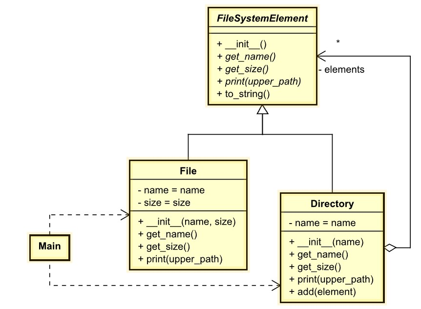

# Composite
Also known as: *Object Tree*

##  Intent
**Composite** is a structural design pattern that lets you compose objects into tree structures and then work with these structures as if they were individual objects.

## Problem
Using the Composite pattern makes sense only when the core model of your app can be represented as a tree.

For example, imagine that you have two types of objects: `Products` and `Boxes`. A `Box` can contain several `Products` as well as a number of smaller `Boxes`. These little `Boxes` can also hold some `Products` or even smaller `Boxes`, and so on.

Say you decide to create an ordering system that uses these classes. Orders could contain simple products without any wrapping, as well as boxes stuffed with products...and other boxes. How would you determine the total price of such an order?

*An order might comprise various products, packaged in boxes, which are packaged in bigger boxes and so on. The whole structure looks like an upside down tree.*

You could try the direct approach: unwrap all the boxes, go over all the products and then calculate the total. That would be doable in the real world; but in a program, it’s not as simple as running a loop. You have to know the classes of `Products` and `Boxes` you’re going through, the nesting level of the boxes and other nasty details beforehand. All of this makes the direct approach either too awkward or even impossible.

## Solution
The Composite pattern suggests that you work with `Products` and `Boxes` through a common interface which declares a method for calculating the total price.

How would this method work? For a product, it’d simply return the product’s price. For a box, it’d go over each item the box contains, ask its price and then return a total for this box. If one of these items were a smaller box, that box would also start going over its contents and so on, until the prices of all inner components were calculated. A box could even add some extra cost to the final price, such as packaging cost.

*The Composite pattern lets you run a behavior recursively over all components of an object tree.*

The greatest benefit of this approach is that you don’t need to care about the concrete classes of objects that compose the tree. You don’t need to know whether an object is a simple product or a sophisticated box. You can treat them all the same via the common interface. When you call a method, the objects themselves pass the request down the tree.

## Real-World Analogy

*An example of a military structure.*

Armies of most countries are structured as hierarchies. An army consists of several divisions; a division is a set of brigades, and a brigade consists of platoons, which can be broken down into squads. Finally, a squad is a small group of real soldiers. Orders are given at the top of the hierarchy and passed down onto each level until every soldier knows what needs to be done.

## Example
Represents a file system composed of files and directories. FileSystemElement makes it possible to treat File and Directory uniformly.

- [UML of example composite](https://htmlpreview.github.io/?https://github.com/takaakit/uml-diagram-for-python-design-pattern-examples/blob/master/structural_patterns/composite/DiagramMap.html)

- Structure
    1. The `FileSystemElement` interface describes operations that are common to both simple and complex elements of the tree.
    2. The `File` is a basic element of a tree that doesn’t have sub-elements. Usually, leaf components end up doing most of the real work, since they don’t have anyone to delegate the work to.
    3. The `Directory` (aka composite) is an element that has sub-elements: `File` or other `Directory`. A `Dicrectory` doesn’t know the concrete classes of its children. It works with all sub-elements only via the component interface.
    Upon receiving a request, a `Dicrectory` delegates the work to its sub-elements, processes intermediate results and then returns the final result to the client.
    4. The `Main` works with all elements through the component interface. As a result, the client can work in the same way with both simple or complex elements of the tree.

## Applicability
- Use the Composite pattern when you have to implement a tree-like object structure.
- Use the pattern when you want the client code to treat both simple and complex elements uniformly.