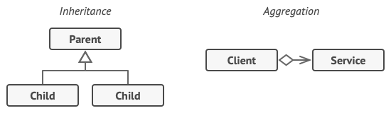
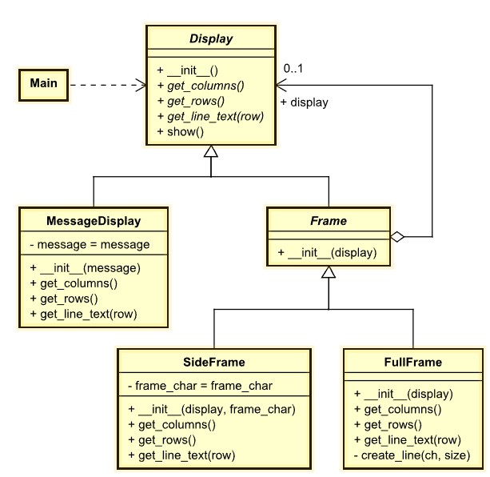

# Decorator
Also known as: **Wrapper**

## Intent
**Decorator** is a structural design pattern that lets you attach new behaviors to objects by placing these objects inside special wrapper objects that contain the behaviors.

## Problem
Imagine that you’re working on a notification library which lets other programs notify their users about important events.

The initial version of the library was based on the `Notifier` class that had only a few fields, a constructor and a single `send` method. The method could accept a message argument from a client and send the message to a list of emails that were passed to the notifier via its constructor. A third-party app which acted as a client was supposed to create and configure the notifier object once, and then use it each time something important happened.

*A program could use the notifier class to send notifications about important events to a predefined set of emails.*

At some point, you realize that users of the library expect more than just email notifications. Many of them would like to receive an SMS about critical issues. Others would like to be notified on Facebook and, of course, the corporate users would love to get Slack notifications.

*Each notification type is implemented as a notifier’s subclass.*

How hard can that be? You extended the `Notifier` class and put the additional notification methods into new subclasses. Now the client was supposed to instantiate the desired notification class and use it for all further notifications.

But then someone reasonably asked you, “Why can’t you use several notification types at once? If your house is on fire, you’d probably want to be informed through every channel.”

You tried to address that problem by creating special subclasses which combined several notification methods within one class. However, it quickly became apparent that this approach would bloat the code immensely, not only the library code but the client code as well.

*Combinatorial explosion of subclasses.*

You have to find some other way to structure notifications classes so that their number won’t accidentally break some Guinness record.

## Solution

Extending a class is the first thing that comes to mind when you need to alter an object’s behavior. However, inheritance has several serious caveats that you need to be aware of.

- Inheritance is static. You can’t alter the behavior of an existing object at runtime. You can only replace the whole object with another one that’s created from a different subclass.
- Subclasses can have just one parent class. In most languages, inheritance doesn’t let a class inherit behaviors of multiple classes at the same time.

One of the ways to overcome these caveats is by using Aggregation or Composition  instead of Inheritance. Both of the alternatives work almost the same way: one object has a reference to another and delegates it some work, whereas with inheritance, the object itself is able to do that work, inheriting the behavior from its superclass.

With this new approach you can easily substitute the linked “helper” object with another, changing the behavior of the container at runtime. An object can use the behavior of various classes, having references to multiple objects and delegating them all kinds of work. Aggregation/composition is the key principle behind many design patterns, including Decorator. On that note, let’s return to the pattern discussion.

*Inheritance vs. Aggregation*

“Wrapper” is the alternative nickname for the Decorator pattern that clearly expresses the main idea of the pattern. A wrapper is an object that can be linked with some target object. The wrapper contains the same set of methods as the target and delegates to it all requests it receives. However, the wrapper may alter the result by doing something either before or after it passes the request to the target.

When does a simple wrapper become the real decorator? As I mentioned, the wrapper implements the same interface as the wrapped object. That’s why from the client’s perspective these objects are identical. Make the wrapper’s reference field accept any object that follows that interface. This will let you cover an object in multiple wrappers, adding the combined behavior of all the wrappers to it.

In our notifications example, let’s leave the simple email notification behavior inside the base `Notifier` class, but turn all other notification methods into decorators.

*Various notification methods become decorators.*

The client code would need to wrap a basic notifier object into a set of decorators that match the client’s preferences. The resulting objects will be structured as a stack.

*Apps might configure complex stacks of notification decorators.*

The last decorator in the stack would be the object that the client actually works with. Since all decorators implement the same interface as the base notifier, the rest of the client code won’t care whether it works with the “pure” notifier object or the decorated one.

We could apply the same approach to other behaviors such as formatting messages or composing the recipient list. The client can decorate the object with any custom decorators, as long as they follow the same interface as the others.

## Real-World Analogy

*You get a combined effect from wearing multiple pieces of clothing.*

Wearing clothes is an example of using decorators. When you’re cold, you wrap yourself in a sweater. If you’re still cold with a sweater, you can wear a jacket on top. If it’s raining, you can put on a raincoat. All of these garments “extend” your basic behavior but aren’t part of you, and you can easily take off any piece of clothing whenever you don’t need it.

## Example
Display a string with decorative frames. The frames can be combined arbitrarily.
- [UML of example decorator](https://htmlpreview.github.io/?https://github.com/takaakit/uml-diagram-for-python-design-pattern-examples/blob/master/structural_patterns/decorator/DiagramMap.html)

- Structure
    1. The `Display` declares the common interface for both wrappers and wrapped objects.
    2. `MessageDisplay` is a class of objects being wrapped. It defines the basic behavior, which can be altered by decorators.
    3. The `Frame` class has a field for referencing a wrapped object. The field’s type should be declared as the `Display` interface so it can contain both concrete components and decorators. The base decorator delegates all operations to the wrapped object.
    4. `SideFrame` and `FullFrame` define extra behaviors that can be added to components dynamically. Concrete decorators override methods of the base decorator and execute their behavior either before or after calling the parent method.
    5. The Client (`Main`) can wrap components in multiple layers of decorators, as long as it works with all objects via the component interface.

## Applicability
- Use the Decorator pattern when you need to be able to assign extra behaviors to objects at runtime without breaking the code that uses these objects.
- Use the pattern when it’s awkward or not possible to extend an object’s behavior using inheritance.