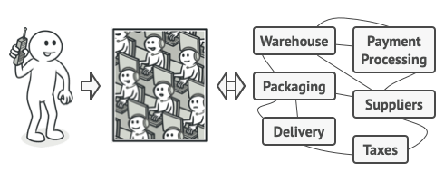
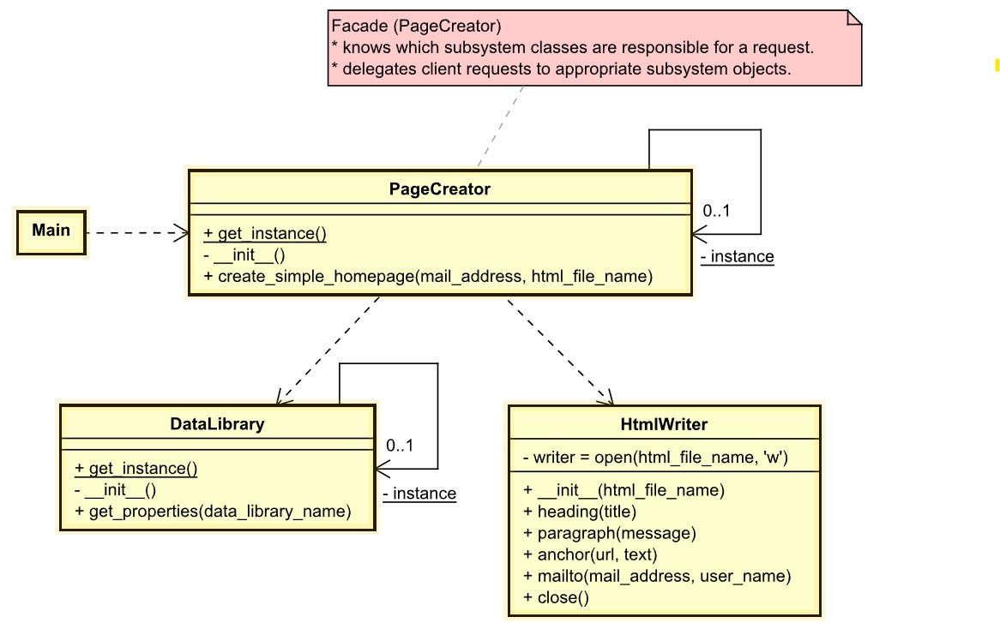

# Facade

## Intent
**Facade** is a structural design pattern that provides a simplified interface to a library, a framework, or any other complex set of classes.

## Problem
Imagine that you must make your code work with a broad set of objects that belong to a sophisticated library or framework. Ordinarily, you’d need to initialize all of those objects, keep track of dependencies, execute methods in the correct order, and so on.

As a result, the business logic of your classes would become tightly coupled to the implementation details of 3rd-party classes, making it hard to comprehend and maintain.

## Solution
A facade is a class that provides a simple interface to a complex subsystem which contains lots of moving parts. A facade might provide limited functionality in comparison to working with the subsystem directly. However, it includes only those features that clients really care about.

Having a facade is handy when you need to integrate your app with a sophisticated library that has dozens of features, but you just need a tiny bit of its functionality.

For instance, an app that uploads short funny videos with cats to social media could potentially use a professional video conversion library. However, all that it really needs is a class with the single method `encode(filename, format)`. After creating such a class and connecting it with the video conversion library, you’ll have your first facade.

## Real-World Analogy

*Placing orders by phone.*

When you call a shop to place a phone order, an operator is your facade to all services and departments of the shop. The operator provides you with a simple voice interface to the ordering system, payment gateways, and various delivery services.

## Example
Create a simple homepage through a Facade (`PageCreator`). The Facade gets info from
the `DataLibrary` and uses the info to create an HTML file.
- [UML of example facade](https://htmlpreview.github.io/?https://github.com/takaakit/uml-diagram-for-python-design-pattern-examples/blob/master/structural_patterns/facade/DiagramMap.html)

- Structure
    1. The Facade (`PageCreator`) provides convenient access to a particular part of the subsystem’s functionality. It knows where to direct the client’s request and how to operate all the moving parts.
    2. An `DataLibrary` class can be created to prevent polluting a single facade with unrelated features that might make it yet another complex structure. Additional facades can be used by both clients and other facades.
    3. The Complex Subsystem (`HtmlWriter`) consists of dozens of various objects. To make them all do something meaningful, you have to dive deep into the subsystem’s implementation details, such as initializing objects in the correct order and supplying them with data in the proper format.
    Subsystem classes aren’t aware of the facade’s existence. They operate within the system and work with each other directly.
    4. The Client (`Main`) uses the `PageCreator` instead of calling the subsystem objects directly.

## Applicability
- Use the Facade pattern when you need to have a limited but straightforward interface to a complex subsystem.
- Use the Facade when you want to structure a subsystem into layers.