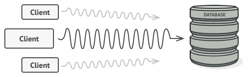

# Proxy
## Intent
**Proxy** is a structural design pattern that lets you provide a substitute or placeholder for another object. A proxy controls access to the original object, allowing you to perform something either before or after the request gets through to the original object.

## Problem
Why would you want to control access to an object? Here is an example: you have a massive object that consumes a vast amount of system resources. You need it from time to time, but not always.

*Database queries can be really slow.*

You could implement lazy initialization: create this object only when it’s actually needed. All of the object’s clients would need to execute some deferred initialization code. Unfortunately, this would probably cause a lot of code duplication.

In an ideal world, we’d want to put this code directly into our object’s class, but that isn’t always possible. For instance, the class may be part of a closed 3rd-party library.

## Solution
The Proxy pattern suggests that you create a new proxy class with the same interface as an original service object. Then you update your app so that it passes the proxy object to all of the original object’s clients. Upon receiving a request from a client, the proxy creates a real service object and delegates all the work to it.

*The proxy disguises itself as a database object. It can handle lazy initialization and result caching without the client or the real database object even knowing.*

But what’s the benefit? If you need to execute something either before or after the primary logic of the class, the proxy lets you do this without changing that class. Since the proxy implements the same interface as the original class, it can be passed to any client that expects a real service object.

## Real-World Analogy

*Credit cards can be used for payments just the same as cash.*

A credit card is a proxy for a bank account, which is a proxy for a bundle of cash. Both implement the same interface: they can be used for making a payment. A consumer feels great because there’s no need to carry loads of cash around. A shop owner is also happy since the income from a transaction gets added electronically to the shop’s bank account without the risk of losing the deposit or getting robbed on the way to the bank.

## Example
Print on a named printer. Setting and changing the printer name is done by Proxy (proxyPrinter). At the time of printing, create an instance of the RealSubject (RealPrinter) for the first time.
- [UML of example proxy](https://htmlpreview.github.io/?https://github.com/takaakit/uml-diagram-for-python-design-pattern-examples/blob/master/structural_patterns/proxy/DiagramMap.html)

- Structure
    1. The `Printer` declares the interface of the `RealPrinter`. The proxy must follow this interface to be able to disguise itself as a service object.
    2. The `RealPrinter` is a class that provides some useful business logic.
    3. The `ProxyPrinter` class has a reference field that points to a `RealPrinter` object. After the proxy finishes its processing (e.g., lazy initialization, logging, access control, caching, etc.), it passes the request to the service object. Usually, proxies manage the full lifecycle of their service objects.
    4. The `Main` should work with both `RealPrinter` and `ProxyPrinter` via the same interface. This way you can pass a proxy into any code that expects a service object.

## Applicability
- Lazy initialization (virtual proxy). This is when you have a heavyweight service object that wastes system resources by being always up, even though you only need it from time to time.
- Access control (protection proxy). This is when you want only specific clients to be able to use the service object; for instance, when your objects are crucial parts of an operating system and clients are various launched applications (including malicious ones).
- Local execution of a remote service (remote proxy). This is when the service object is located on a remote server.
- Logging requests (logging proxy). This is when you want to keep a history of requests to the service object.
- Caching request results (caching proxy). This is when you need to cache results of client requests and manage the life cycle of this cache, especially if results are quite large.
- Smart reference. This is when you need to be able to dismiss a heavyweight object once there are no clients that use it.